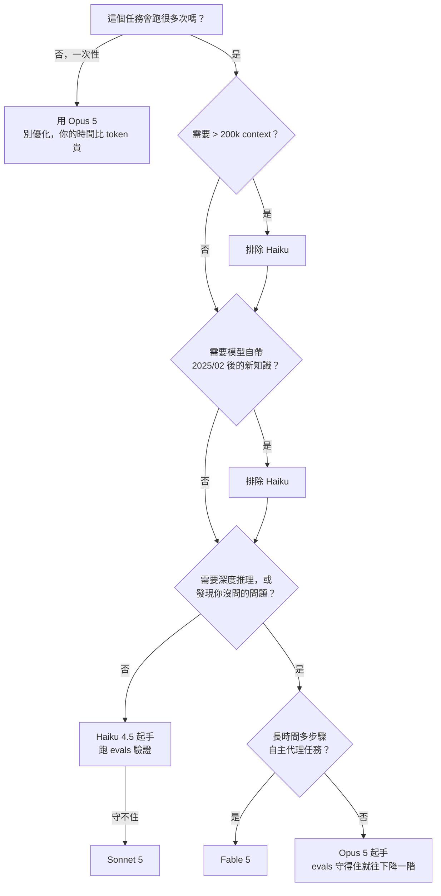

# 【Day 6】Claude 模型選擇決策表：一張圖判斷你該用哪一個

## 聯繫我

如果有任何問題或建議，歡迎隨時聯繫我：

- [Email](mailto:z0925955648@gmail.com)

## 前言

五天下來，我們累積了不少判斷依據：四階模型的規格差異、1:5 的計價結構、由上往下的選型流程、Haiku 的四道判準、context 的取捨。

資訊量不小。而資訊量一大，就會發生一件事——**你在真正要做決定的那一刻，一條都想不起來。**

所以今天不講新東西。今天做一件事：**把前五天收斂成一張你可以貼在螢幕旁邊、五秒鐘查完的決策表。**

這是第一階段的收尾。明天開始我們進入第二階段，專心處理「省」這件事。但在那之前，先把「選對」這件事變成肌肉記憶。

> 本篇是 Day 1～Day 5 的濃縮。所有規格數據皆於 **2026 年 8 月 8 日**對照官方文件查證，各項細節的完整說明請見對應天數。

## 目錄

| 天數 | 主題 | 描述 |
| :--- | :--- | :--- |
| Day 1 | Claude 模型怎麼選？2026 最新四階模型完整比較 | Fable 5 / Opus 5 / Sonnet 5 / Haiku 4.5 的定位、規格與適用場景 |
| Day 2 | Claude 的計價邏輯：搞懂 input / output 為什麼差 5 倍 | 不背數字，理解計價結構，建立可長期沿用的成本直覺 |
| Day 3 | 不知道用哪個模型？官方建議「從 Opus 5 開始」背後的思維 | 為什麼預設起手不是最便宜、也不是最強的那個 |
| Day 4 | Claude Haiku 4.5 適合做什麼？便宜模型的正確用法 | 便宜模型不是次等品，是專用工具 |
| Day 5 | Claude context window 是什麼？1M token 到底能塞多少東西 | 用實際檔案量換算，破除「塞越多越好」的迷思 |
| Day 6 | Claude 模型選擇決策表：一張圖判斷你該用哪一個 | 把前五天濃縮成一張可以貼在螢幕旁的決策流程 |
| Day 7 | Token 是什麼？為什麼你的 Claude 帳單比想像中貴 | 從 tokenizer 原理理解中文為什麼特別燒錢 |
| Day 8 | Claude 省 token 的 5 個實用技巧（一般使用者也適用） | 不寫程式也能立刻套用的五個習慣 |
| Day 9 | Prompt Caching 是什麼？讓重複內容只算 10% 費用 | 快取寫入與命中的計價邏輯，以及什麼時候會虧 |
| Day 10 | Claude Batch API 教學：非即時任務直接省一半費用 | 用時間換金錢，非同步任務的正確打開方式 |
| Day 11 | 新世代 tokenizer：同樣的中文為什麼變貴了 | Claude 4.7 世代換了 tokenizer，這對中文使用者的實際影響 |
| Day 12 | 對話越長越燒錢？Claude 長對話的成本陷阱與解法 | 每一輪都重算全部歷史——以及三種切斷成本累積的做法 |
| Day 13 | Claude 用量怎麼監控？成本失控前的預警機制 | 從 usage 欄位到 Console 儀表板，把帳單變成可觀測系統 |
| Day 14 | Claude effort 參數是什麼？五個檔位該怎麼設 | `low` / `medium` / `high` / `xhigh` / `max` 的取捨與實測建議 |
| Day 15 | Adaptive Thinking 是什麼？為什麼你不用再寫「think step by step」 | 模型自己決定何時思考，舊 prompt 技巧為何失效 |
| Day 16 | Claude 回答變淺了？檢查這兩個隱藏設定 | 排查思路：先看 effort，再看 thinking 設定 |
| Day 17 | Claude Prompt 寫法教學：官方最佳實踐的骨架 | 一個可以套用在 90% 情境的 prompt 結構 |
| Day 18 | 用 XML 標籤讓 Claude 輸出更穩定（結構化輸出教學） | 為什麼 Claude 特別吃 XML，以及怎麼設計標籤 |
| Day 19 | System Prompt 怎麼寫？角色設定的正確姿勢 | system 與 user 的分工，以及「你是一位專家」為什麼沒用 |
| Day 20 | Claude 幻覺怎麼防？降低錯誤輸出的實用做法 | 引用來源、允許說不知道、把驗證寫進流程 |
| Day 21 | Claude Code 是什麼？安裝與第一次使用完整教學 | 從安裝到跑完第一個任務，含常見卡關點 |
| Day 22 | Claude Code 省 token 設定：別讓它讀完整個專案 | `CLAUDE.md`、忽略規則與 context 控制的實戰配置 |
| Day 23 | MCP 是什麼？把外部工具接進 Claude 的原理與實作 | Model Context Protocol 的設計哲學與一個可跑的範例 |
| Day 24 | 前端如何呼叫 Claude API？Messages 端點入門 | 第一支 API 請求，以及為什麼不該在瀏覽器直接呼叫 |
| Day 25 | Claude 串流輸出（Streaming）：打造即時回應體驗 | SSE 事件流解析與前端逐字渲染 |
| Day 26 | Claude API 錯誤處理與重試：正式環境該注意什麼 | 429 / 529 的正確退避策略與冪等性設計 |
| Day 27 | 模型分流（Model Routing）是什麼？別再一支模型用到底 | 依任務難度動態選模型的判斷邏輯 |
| Day 28 | LLM 成本優化架構：小模型前置分流 + 大模型收尾 | 一套可落地的分層架構與失敗處理 |
| Day 29 | Vibecoding 做出網站之後：AI 不會主動告訴你的那些事 | 門檻降低的是「做出來」，不是「做對」——怎麼問出你不知道要問的問題 |
| Day 30 | Claude 使用總整理：模型、成本、設定一次看懂 | 全系列濃縮成一份可以收藏的速查表 |

## 一、主決策樹

從 Q1 開始，一路往下答。看到 **【終點】** 就停，那就是你的答案。

**Q1｜這個任務會跑很多次嗎？**

- **否**，一次性 → 用 **Opus 5**，別優化——你的時間比 token 貴　**【終點】**
- **是**，會重複跑 → 往下

**Q2｜需要超過 200k context 嗎？**

- **是** → 淘汰 **Haiku 4.5**，往下
- **否** → 往下

**Q3｜需要模型「自己知道」2025 年 2 月之後的新知識嗎？**

> 判準：資料能直接餵進 prompt 的話，就算「否」。

- **是** → 淘汰 **Haiku 4.5**，往下
- **否** → 往下

**Q4｜需要深度推理，或需要它「發現你沒問到的問題」嗎？**

> 判準：這件事你自己做，需要停下來想一下嗎？

- **否** → **Haiku 4.5** 起手，跑 evals 驗證
  - 守不住？→ 升級 **Sonnet 5**　**【終點】**
- **是** → 往下

**Q5｜是長時間、多步驟的自主代理任務嗎？**

> 判準：數十個步驟／要跑好幾個小時。

- **是** → **Fable 5**　**【終點】**
- **否** → **Opus 5** 起手，跑 evals，守得住就往下降一階　**【終點】**

GitHub 上也可以看流程圖版本：

## 二、四個判斷維度速查

決策樹背後其實只有四個維度。記住這四個，你不用看圖也能判斷：

| 維度 | 問自己 | 卡住的話 |
| :--- | :--- | :--- |
| **容量** | 要塞的東西超過 200k 嗎？ | 排除 Haiku 4.5 |
| **知識新鮮度** | 需要模型「自己知道」最近的事嗎？ | 排除 Haiku 4.5，或改成把資料餵進去 |
| **推理深度** | 這件事我自己做要「想一下」嗎？ | 要想 → Opus 5 起跳 |
| **時間壓力** | 有人正盯著螢幕等嗎？ | 有 → 往快的挑；沒有 → 加上批次折扣 |

> **注意「知識新鮮度」那一列的第二個選項。** 很多看起來需要新知識的任務，只要把最新資料直接放進 prompt，就從「需要模型知道」變成「需要模型讀」——**判準就過關了，可以降級。**
>
> 這是最容易被忽略的一次降級機會。

## 三、常見情境直接查表

懶得跑決策樹的話，先在這裡找你的情境：

| 情境 | 建議 | 為什麼 |
| :--- | :--- | :--- |
| 情緒／意圖／工單分類 | **Haiku 4.5** + 批次 | 四道判準全過，量大 |
| 發票、表單、履歷欄位抽取 | **Haiku 4.5** | 資訊都在輸入裡，不需推理 |
| 高頻自動補全、輸入建議 | **Haiku 4.5** | 最快，而且使用者在等 |
| 分流前置判斷（判斷難度） | **Haiku 4.5** | 用便宜的保護貴的 |
| 客服即時回覆 | **Sonnet 5** | 要品質也要速度，量還大 |
| 讀 100 頁文件做問答 | **Sonnet 5** | 有 1M context，且比 Opus 5 便宜快速 |
| Code review、找 bug | **Opus 5** | 需要「發現你沒問的問題」 |
| 重構模組、複雜編碼 | **Opus 5** | 官方欽點的主場 |
| 一次性的個人任務 | **Opus 5** | 別優化，優化的時間比省下的錢貴 |
| 跑好幾小時的自主代理 | **Fable 5** | 為 long-running 而生 |
| 需要最高能力，且已驗證有需要 | **Fable 5** | 官方的但書：確定需要才用 |

## 四、三條原則（比表格更耐用）

表格會過期，模型會改版。但這三條原則不會：

**① 先確認做得對，再往下調到省。**

從能力充足的地方起步，建立基準線，然後在**有評測證據**的前提下逐階降級。反過來做——先追求省再想辦法變對——那不是優化，那是猜。（Day 3）

**② 不為你用不到的能力付錢。**

省不是砍到最便宜，是把「這個任務真正需要什麼」盤點清楚，然後不多買。四個維度全部用不到的任務，用最貴的模型只是在燒錢。（Day 1、Day 4）

**③ 篩選放什麼，跟有多少空間一樣重要。**

1M context 不是「不用思考」的許可證。塞太多會 context rot，而且**快取只會讓它變便宜，不會讓它不佔位子**。（Day 5）

## 五、什麼時候該重新跑一次這張表？

決策不是做一次就結束。四個時機該重跑：

- **模型改版時。** 官方對 `effort` 的提醒同樣適用於選模型：「**run a fresh effort sweep on your evals rather than reusing them**」——連你自己上次調好的設定都不算證據。
- **用量規模跳一個量級時。** 每天 100 次跟每天 100,000 次，值得優化的程度差 1000 倍。
- **任務內容漂移時。** 使用者的問題變複雜了、輸入變長了，原本的判準可能已經不成立。
- **帳單超出預期時。** 這時候先別急著換模型——**先確認錢花在哪裡**。這是 Day 13 的主題。

## 六、四個常見的選錯模式

決策表告訴你該怎麼選。但實務上選錯這件事，其實有固定的形狀——認得出來，就能提早攔下。

**① 複製貼上慣性**

*症狀：* 你的專案裡有五處在呼叫 Claude，全部用同一個模型，而那個模型是你第一次寫的時候從某篇教學文複製過來的。

*為什麼危險：* 這根本不是判斷，是遺留設定。而且它會擴散——後來的人看到既有程式碼這樣寫，就跟著這樣寫。

*怎麼修：* 把模型名稱從各處抽出來，變成一個依任務命名的設定：`MODEL_FOR_CLASSIFY`、`MODEL_FOR_REVIEW`。光是被迫替它取名字，你就會被逼著想清楚這個呼叫在做什麼。

**② 一支模型走天下**

*症狀：* 「我們統一用 Sonnet 5，簡單好管理。」

*為什麼危險：* 統一確實好管理，但它的代價是**所有任務都按最難的那個定價**。你的分類任務在補貼你的 code review。

*怎麼修：* 不必一步跳到完整的模型分流。先從**用量最大的那一個**任務下手就好——通常前兩名的呼叫量就佔了八成以上的帳單。

**③ 出事就升級**

*症狀：* 結果品質不好 → 換更貴的模型 → 好一點了 → 收工。

*為什麼危險：* 這是 Day 3 講的「沒有基準線」的另一面。**升級之所以有效，常常是因為更強的模型會自己補完你沒寫清楚的意圖**——問題被掩蓋了，不是被解決了。你付了 5 倍的錢買一個 prompt 修補服務。

*怎麼修：* 升級之前先問一句：**如果我把指令寫得更明確，現在這個模型做得到嗎？** 先花十分鐘改 prompt，改完還是不行，那才是真的需要升級。

**④ 憑感覺降級**

*症狀：* 「我用 Haiku 試了幾次，看起來還可以，就換過去了。」

*為什麼危險：* 「試了幾次」通常試的都是簡單案例——而簡單案例任何模型都會過。真正的問題會在正式環境遇到第一個複雜輸入時才爆，而且往往是**靜默的**（Day 4）。

*怎麼修：* 二十個測試案例，其中三到五個是你**刻意挑出來的難題**。這是 Day 3 的最小可行 evals，十行程式碼的事。

> 這四個模式有個共同點：**它們都是在迴避「這個任務到底需要什麼」這個問題。**
>
> 複製貼上是不想想，一支到底是不想分開想，出事就升級是用錢換不用想，憑感覺降級是想了但沒驗證。
>
> 而這整張決策表，說穿了就是逼你把那個問題想完一次。

## 本篇自我挑戰

- **今日挑戰**：把上面那張決策樹跑過你目前**所有**在用 Claude 的地方（不是挑一個，是全部列出來）。做成一張三欄的表：**任務 / 現在用什麼 / 決策樹說該用什麼**。

  重點看第二欄跟第三欄不一樣的那幾列。對每一列問一句：**我當初為什麼選了現在這個？**

  我自己做這件事的時候，發現我有四個地方在用 Opus 5，其中三個的答案是「因為我第一次寫的時候複製了別人的範例，然後就沒改過」。這不是判斷，這是慣性。

- **反思**：這張表最大的風險，其實是它太好用了——好用到你會照著查、而不再思考。你覺得什麼情況下**應該推翻這張表**？我的答案是：**當你的任務有一個這四個維度都描述不到的特性時。** 例如合規要求、資料落地、或是某個模型在你的特定領域上就是表現特別好。表格處理的是通則，例外永遠需要你自己判斷。你的工作裡有這種例外嗎？

## 總結

第一階段到這裡告一段落。五天下來，我們其實只做了一件事：**把「選哪個模型」從一個憑感覺的問題，變成一個有依據的問題。**

決策樹只有四個維度：**容量、知識新鮮度、推理深度、時間壓力**。四個都不吃緊的任務交給 Haiku 4.5，需要深度推理的從 Opus 5 起手，長時間代理任務才輪到 Fable 5，而一次性的任務——**別優化，用 Opus 5，你的時間比 token 貴**。

比表格更耐用的是三條原則：**先對再省、不為用不到的能力付錢、篩選跟空間一樣重要。**

明天進入第二階段。我們已經知道該選哪個模型了，接下來要處理的是另一半——**同樣的模型，怎麼用得更省**。而第一站要回答一個最基礎、也最多人誤會的問題：**token 到底是什麼？**

**本日關鍵字回顧**

- **四個判斷維度**：容量、知識新鮮度、推理深度、時間壓力。決策樹的全部骨架。
- **知識可替代性**：需要模型「自己知道」才算數；把資料餵進 prompt 就從知識問題變成 context 問題，可據此降級。
- **一次性任務不優化**：呼叫次數少時，優化成本高於節省金額，直接用 Opus 5。
- **重評時機**：模型改版、用量跳級、任務漂移、帳單異常。
- **表格的極限**：通則之外的例外（合規、資料落地、特定領域表現）仍需人為判斷。

明天開始，我們把鏡頭對準帳單本身。你知道同樣一句「你好嗎」，中文和英文吃掉的 token 數不一樣嗎？而這個差異，正是很多中文開發者帳單失控的起點。

**Day 7，我們從 token 的本質談起。**
